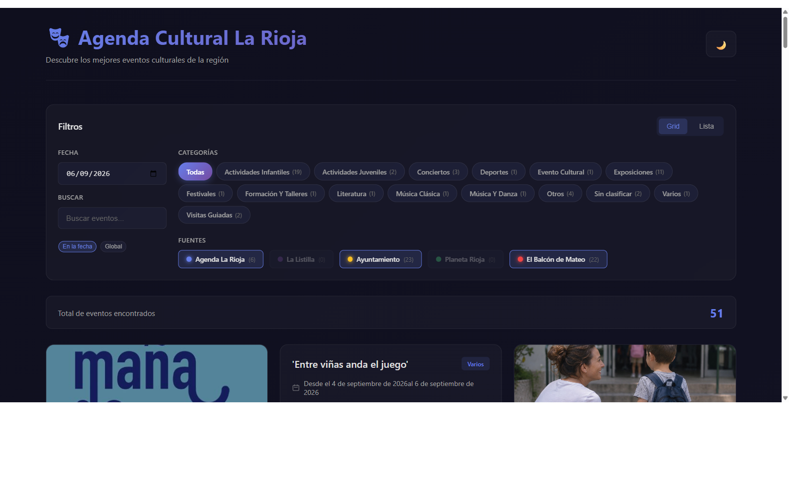
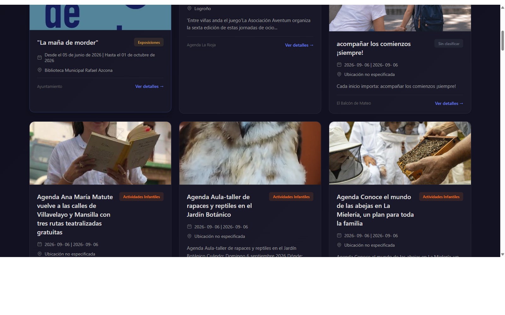
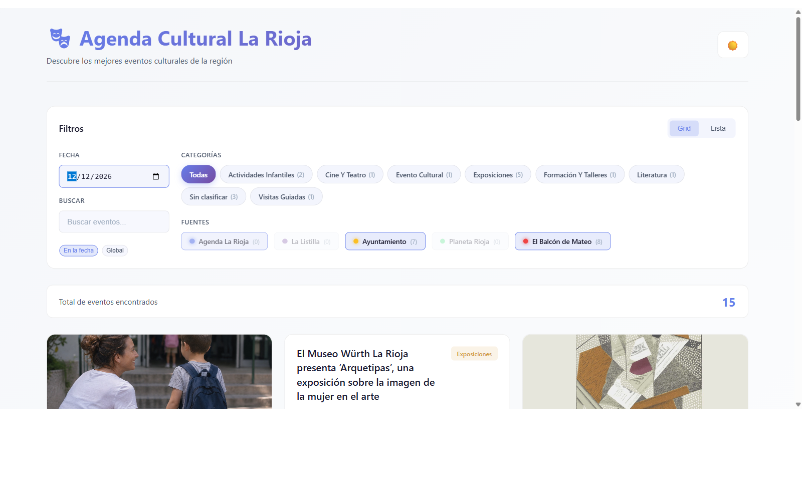

# 🎭 Agenda Cultural La Rioja

**Todos los eventos culturales de La Rioja, unificados en un solo sitio.**
Rastreamos las mejores agendas de la región (institucional, municipal, medios locales y
blogs familiares), limpiamos y normalizamos los datos, y los servimos en una web con
filtros por fecha, categoría y fuente. Sin registrarse, sin configurar nada: abres y
ves qué hacer hoy, este fin de semana o dentro de tres meses.



## Así luce la aplicación

| | |
|---|---|
|  |  |
| **Rejilla visual** - cada evento con su imagen, categoría, fechas y fuente de origen. Modo claro y oscuro incluidos. | **Agenda futura** - eventos cubiertos hasta final de 2026 (y más allá). Elige cualquier fecha y mira qué hay ese día. |

## Usarlo es así de fácil

1. **Elige el día.** Cambia la fecha y verás al instante los eventos de ese día.
2. **Filtra a tu gusto.** Por categoría (conciertos, exposiciones, planes con niños...),
   por fuente, o busca por texto con el buscador global.
3. **Abre el evento.** Cada tarjeta enlaza a la página original con todos los detalles.
   Cambia entre vista rejilla o lista, y activa el modo oscuro con la luna 🌙.

## Fuentes unificadas

| Fuente | Qué es |
|---|---|
| Agenda La Rioja | Agenda cultural oficial del Gobierno de La Rioja |
| Ayuntamiento de Logroño | Agenda municipal de ocio y cultura |
| La Listilla | Agenda semanal de planes en La Rioja |
| Planeta Rioja | Planes +55 de El Balcón Silver |
| El Balcón de Mateo | Agenda familiar y actividades infantiles |

## Estructura

```
crawl_configs/        # Configuraciones YAML por sitio (selectores / prompts)
crawlers/             # Scripts asincrónicos basados en Crawl4AI
data/eventos_raw/    # Salida cruda por origen
data/processed/      # Datos ya limpios y consolidados
process/              # Limpieza y normalización
frontend/             # UI rápida (Streamlit)
requirements.txt      # Dependencias del proyecto
```

## Requisitos previos

- Python 3.10 o superior (Crawl4AI >= 0.7 requiere >= 3.10).
- Google Chrome o Chromium disponible para Playwright (Crawl4AI lo usa internamente).

## Preparar el entorno (Windows PowerShell)

```powershell
cd C:\PRUEBAS\CRAWLER-EVENTO
python -m venv .venv
.\.venv\Scripts\Activate.ps1
python -m pip install --upgrade pip
pip install -r requirements.txt

# Configuración inicial de Crawl4AI / Playwright
crawl4ai-setup
python -m playwright install --with-deps chromium
```

> Si la última línea falla por falta de privilegios, vuelve a ejecutarla con PowerShell como Administrador.

## Ejecutar un crawl de ejemplo

1. Ajusta o añade un YAML dentro de `crawl_configs/` si quieres cambiar selectores.
2. Lanza el crawler para una o varias fuentes (usa el nombre del archivo sin `.yaml`):

```powershell
python -m crawlers.do_crawls --only agenda_larioja
python -m crawlers.do_crawls --only elbalcon_mateo
```

El JSON resultante quedará en `data/eventos_raw/<nombre>.json`.

### Fuentes incluidas

- `agenda_larioja`: Agenda oficial de La Rioja.
- `larioja_lalistilla`: Agenda semanal de La Listilla.
- `logrono_agenda`: Agenda municipal de Logroño (con paginación).
- `planeta_rioja_planes`: Planes +55 de El Balcón Silver (con paginación).
- `elbalcon_mateo`: Agenda familiar de El Balcón de Mateo.

`elbalcon_mateo` usa generación dinámica de URLs por rango de fechas mediante `date_range` en su YAML. Puedes ajustar `days_ahead` y `chunk_days` para cubrir más/menos tiempo.

## Normalizar y consolidar datos

```powershell
python -m process.clean_and_merge
```

Esto genera `data/processed/eventos_por_dia.json` con los eventos agrupados por fecha.

## Interfaz rápida

```powershell
streamlit run frontend/app.py
```

La app carga los datos consolidados y sirve la interfaz web con filtros por fecha, categoría y fuente.

## Próximos pasos sugeridos

- Añadir más configuraciones dentro de `crawl_configs/` y volver a lanzar `python -m crawlers.do_crawls`.
- Incluir lógica de _retry_ y logging estructurado en `crawlers/do_crawls.py`.
- Añadir tests para la normalización de fechas/categorías en `process/clean_and_merge.py`.
